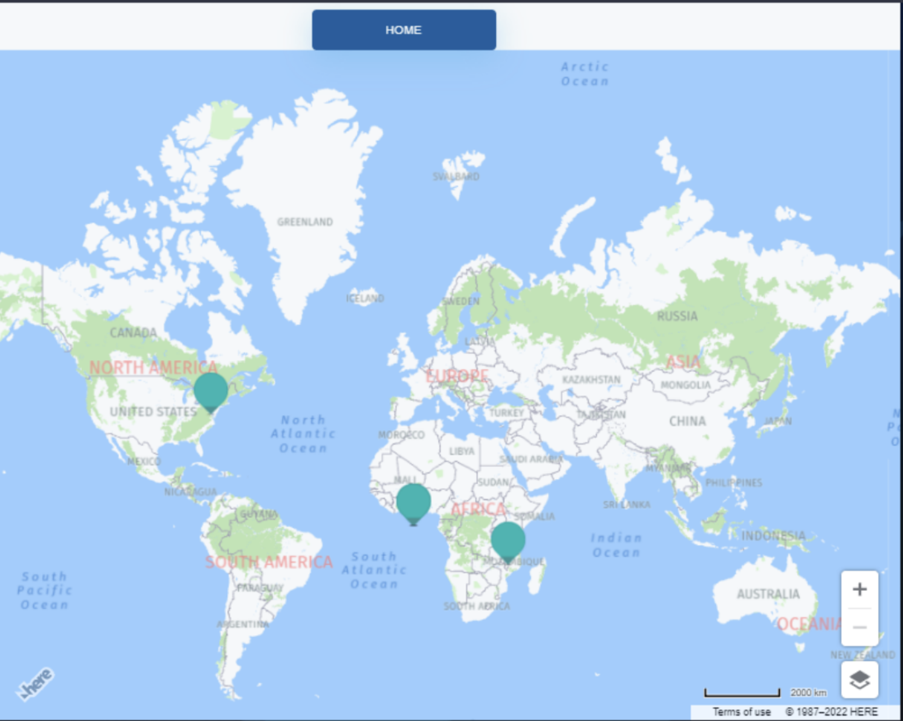

# **Twitter Analyzer**

## **Table of Contents**

- [Description](#description)
- [Features](#features)
- [Technologies Used](#technologies-used)
- [Screenshots](#screenshots)
  - [Home Page](#home-page)
  - [Chart View](#chart-view)
  - [Tweet View](#tweet-view)
  - [Map View](#map-view)

## **Description**

**Twitter Analyzer** is a powerful tool designed to analyze tweets based on user-defined keywords and parameters. Built with **React**, **Node.js**, and **MongoDB**, it provides a seamless way to fetch, store, and visualize Twitter data. Users can explore tweet insights through charts, a map view, and a detailed tweet list.

## **Features**

- **Search Tweets**: Enter a keyword and the number of tweets to fetch.  
- **Store Tweet Data**: Save tweets in MongoDB, including:
  - Tweet content
  - Retweet count
  - Location (if available).  
- **Visualize Data**:
  - **Chart View**: Displays retweet counts of each tweet on a linear chart.  
  - **Tweet View**: Lists the content of all fetched tweets.  
  - **Map View**: Uses the **Here API** to show tweet locations on an interactive map.

## **Technologies Used**

- **Frontend**: EJS , HTML  
- **Backend**: Node.js, Express.js, Mongoose 
- **Database**: MongoDB  
- **APIs**: Twitter API, Here API  
- **Styling**: CSS  

## **Screenshots**

### **Home Page**

### **Chart View**

### **Tweet View**

### **Map View**

## **Author**
Aravindh NC

